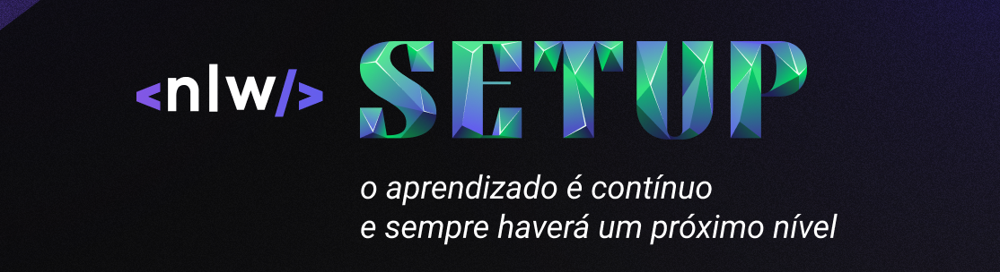
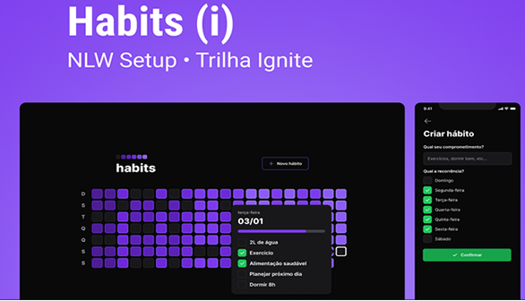
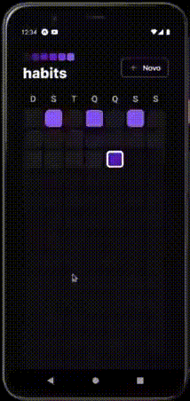

  
  

<h1 align="center"> NEXT LEVEL WEEK 11 / Trilha Ignite /</h1>

 

## 🚀 Tecnologias

Esse projeto foi desenvolvido com as seguintes tecnologias:

  
  
  
    
  
  
  
  
  
  
  
  
  

## 💻 Projeto

Foi desenvolvido com o propósito de criar resgistros de hábitos, foi criado desde o Back-end a uma WebPage e um App.
[Mais detalhes do projeto aqui.](https://efficient-sloth-d85.notion.site/NLW-11-Setup-4a8623c9e0bf415dbd5fdbe79f387a6e)

###  Visualização do projeto

 

  
  

## :memo: Licença

    Esse projeto está sob a licença MIT.3  
  

